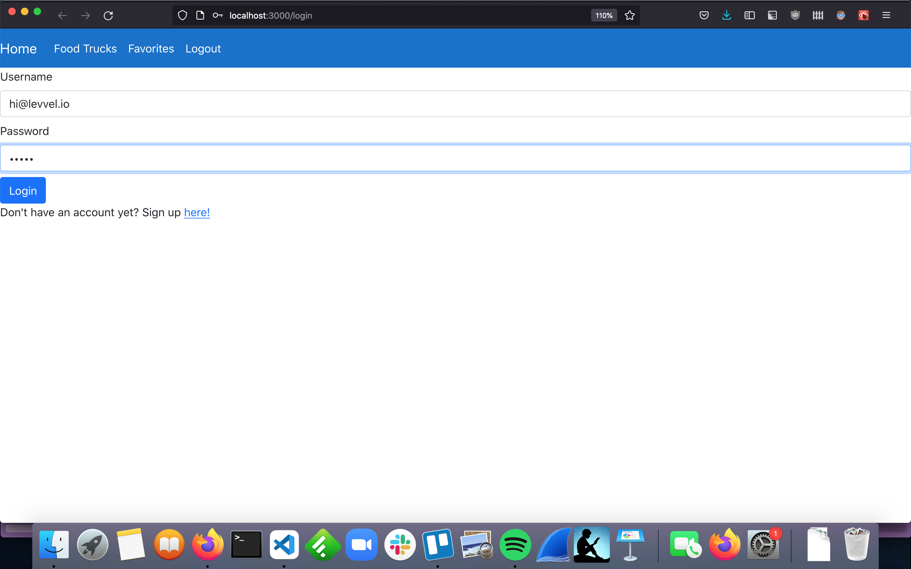
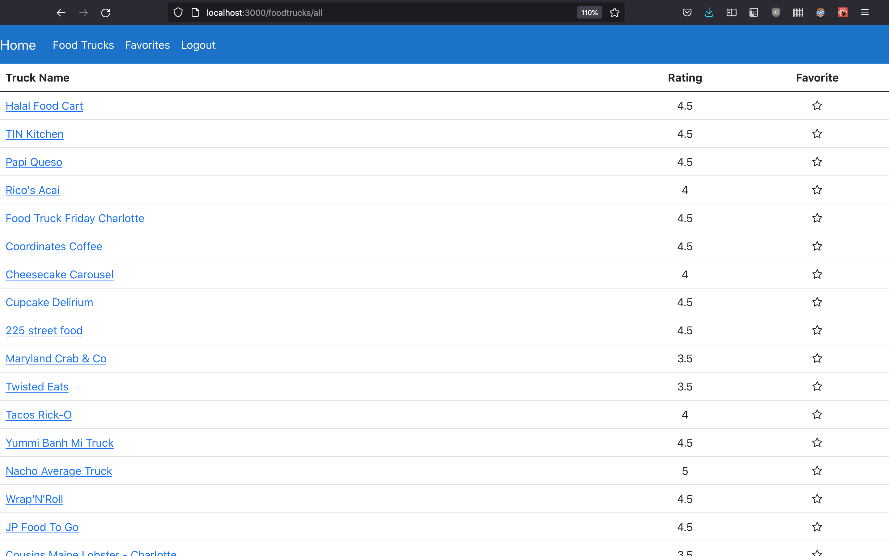
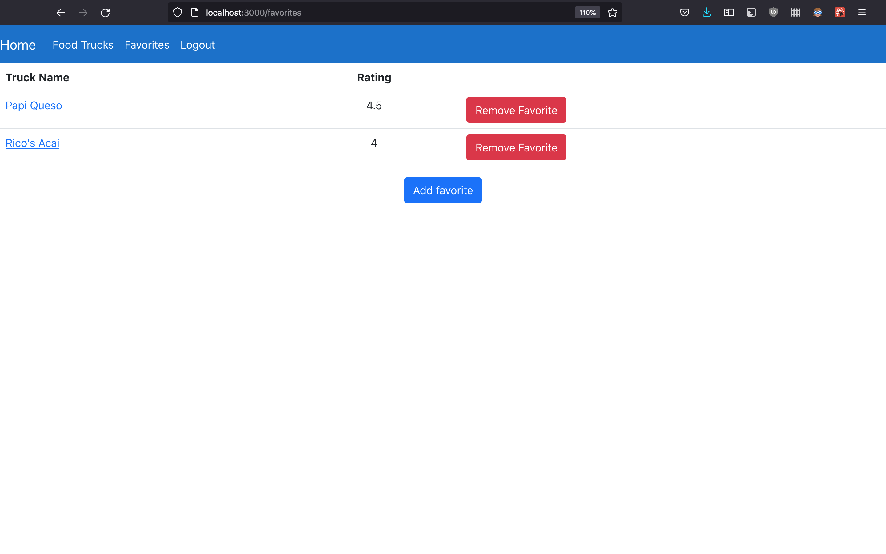
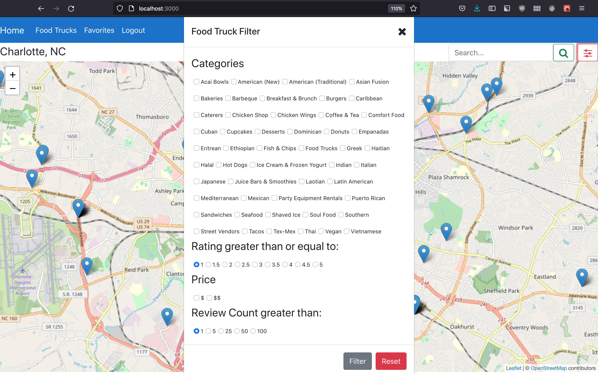

# Description


This is the Charlotte Food Trucks application. It sources data from the Yelp API and enables the user to look at and favorite food trucks on the Charlotte area. This application could be used to see what food trucks are in an area nearby oneself at a particular time, or could be used by a curious person who wants to see what the Charlotte food truck scene has to offer.

## Getting Started

### Cloning the Repo

To clone the repo and navigate to the directory where the project files are, run the following commands in your terminal:

```
git clone https://github.com/zaataylor/front-end-project.git
cd front-end-project/charlotte-food-trucks
```

### API Key and Environment Variable Setup

To run the application locally, you'll need:

- A Yelp API Key, which can be obtained as described [here](https://www.yelp.com/developers/documentation/v3/authentication).
- `npm`, which is automatically installed when you install [Node.js](https://nodejs.org/en/download/), and
- properly configured project environment variables.

To configure the project environment variables, there are two main steps:

1. Find the `.env` file located under `charlotte-food-trucks/food-truck-backend` and do the following:

   - Set the `YELP_API_KEY` variable to the value you obtained from Yelp (see previous paragraph).
   - Set the `TOKEN_SECRET` variable to anything you choose. It can be something like `MYFAVORITESECRET` or you can leave it as is. This is only used when the server signs [JSON Web Tokens](https://jwt.io/). **Note: Remember this value, as you'll need it in the next step!**

2. Find the `.env` file located under `charlotte-food-trucks/food-truck-frontend` and do the following:
   - Set the `REACT_APP_TOKEN_SECRET` variable to the _same_ value you set `TOKEN_SECRET` in the previous step.

Now, you're all set! ☺️

### Running the Application

Once you've obtained an API key, have Node and `npm` on your system, and have properly configured the environment variables, you can start the application by doing the following:

1. In the current terminal instance, navigate to the backend of the food truck app and start the application by running:
   ```
   cd food-truck-backend
   node server.js
   ```
2. Now, create another terminal instance. Change the working directory to `front-end-project/charlotte-food-trucks`. Next, navigate to the frontend of the food truck app and start it by running:
   ```
   cd food-truck-frontend
   npm start
   ```
3. Visit `localhost:3000` in your browser if the running frontend application has not already redirected you there.
4. Have fun!

## How to Use the Application

As a user of the Charlotte Food Trucks application, you can easily find and favorite great food trucks after signing in.

### Login and Sign Up



When you first start the application, you'll be redirected to the login page. If you don't have any account, don't worry! You can very easily navigate to the signup page instead and make an account there. Once you've either logged in or signed up for an account, you'll automatically be redirected to the main food trucks view, which will pull up a map of Charlotte centered on Uptown.

### The Map View


The first time you login, if there are food trucks in the area (which there should be, barring anomalous conditions), you'll see lots of little blue popup marker icons representing the current location of the food trucks on the map view. You can click on any one of these to see the name of the food truck and a link to a page containing more information about that specific truck.

### See All Food Trucks


To see all the available food trucks, you can click "Food Trucks" in the navigation bar, which will show a structured, tabular view representing data from all of the trucks. Each truck's name and rating will be located there, as well as a star icon. Clicking on this star icon will favorite or unfavorite a particular food truck, depending on if the icon was initially empty or filled in, respectively.

### Check Food Truck Favorites


If you want to examine the list of your favorited food trucks, you can click "Favorites" in the navigation bar text, which navigates to a page that lets you add or remove trucks from your favorites list.

### Searching and Filtering Food Trucks

If you want to search by food truck name, you can navigate to the map view using "Home" in the navigation bar and then start typing in the text box beside the magnifying glass icon.


If you want to filter by things like food truck price, cuisine category, number of reviews, or rating, you can click the red filter icon beside the magnifying glass icon, which should pop out a modal containing the characteristics you want to filter by. You can clear these filters and close the modal at any time by pressing the "Reset" button, or you can apply the filters you've selected by clcking the "Filter" button.

### Logout

To logout, simply click "Logout" in the navigation bar.
